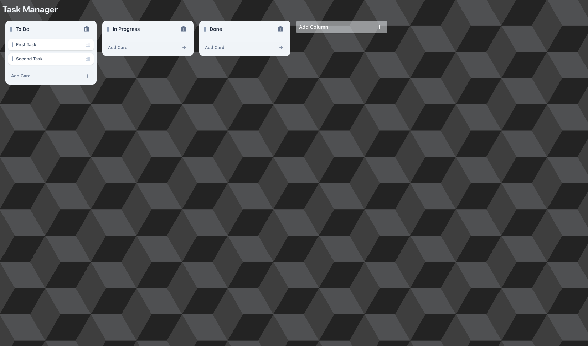

# 🗂️ React Task Manager

An interactive Kanban board built with React. Users can manage dynamic columns and task cards, track progress visually, and persist data using localStorage.



## ✨ Features

- **Dynamic Columns**

  - Add new columns
  - Rename existing columns
  - Delete columns

- **Task Cards**

  - Add new tasks to any column
  - Edit task title, description, and comments
  - Delete tasks

- **Comments**

  - Add, edit, and remove comments inside a task's detail view

- **Drag & Drop**

  - Move tasks within a column
  - Move tasks across columns
  - Reorder columns

- **Persistence**
  - All data is stored in `localStorage` and loaded on refresh

## 🧑‍💻 Tech Stack

- **Vite**
- **TypeScript**
- **React**
- **Tailwind CSS** for styling
- **Jest** for unit testing

## 🚀 Getting Started

### Prerequisites

- Node.js >= 22.17.1

### Installation

```bash
npm i
npm run dev
```

- Visit http://localhost:5173 in your browser.

## 🧪 Running Tests

```
npm run test
```

Includes unit tests for the reducer logic/core functionality.

## 📌 Notes

This project was completed as part of a technical interview task.
Emphasis was placed on design, clean state management, functional UI, and strong user experience with smooth interactions.

Page is fully responsive and animated.

To stay as close as posible to the expected timeframe, some compromises were made:

- Sub-comments were omited as I believe the only complexity (deep state updates through `useReducer`) is already showcased throughout the reducer.
- Keyboard navigation was omited, but keyboard eventes were used to confirm text inputs to showcase the use of keyboard events.

`react-router-dom` was installed but only one page was implemented. It was left installed so the reviewer knows I'm aware of it and know how to use it.

While not part of the main recquirements, I added unit tests to the reducer as I think testing is a high priority when it comes to development of an ongoing application.

Almost no comments were left in the code. I always try to make the code as readable as posible by naming functions using imperative tense and having self-explanatory variable names.
